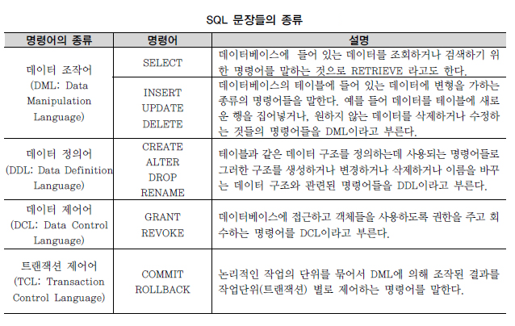

# WIL #4
## 항해99 부트캠프 ing

### 스프링 MVC 기본 구조


 스프링 프레임워크는 하나의 기능을 위해서만 만들어진 프레임워크가 아닌 '코어'라고 할 수 있는 여러 서브 프로젝트를 결합해서 다양한 상황에 대처할 수 있도록 개발되었다. 그 중 하나가 스프링 MVC 구조이다.


* 스프링 MVC

  [Spring MVC]	- WEB 관련 영역
  [Spring Core]	- 일반 JAVA 영역(POJO)
  [Spring-Mybatis] (Mybatis는 JPA 대체 가능)
  [Mybatis]
  [DB]

  프로젝트 구동은 web.xml 에서 시작한다. web.xml 상단에는 가장 먼저 구동되는 Context Listener가 등록되어 있다.

* 특징

    1. ContextLoaderListener는 해당 웹 어플리케이션을 구동하게 되면 같이 작동이 시작되므로 해당 프로젝트를 실행하면 가장 먼저 로그를 출력하면서 실행된다.
    2. root-context.xml이 처리되면 파일에 있는 빈(Bean)들이 작동한다.
    3. root-context.xml이 처리된 후에는 DispatcherServlet이라는 서블릿과 관련된 설정이 작동한다. MVC구조에서 가장 핵심적인 역할을 하는 클래스이며 내부적으로 앱 관련 처리의 준비 작업을 진행한다. 내부적으로 웹 관련 처리의 준비 작업을 진행하기 위해 사용하는 파일이 있고 servlet-context.xml이다.
    4. DispatcherServlet에서 XmlWebApplicationContext를 이용해서 servlet-context.xml을 로딩하고 해석한다. 이 과정에서 등록된 객체(Bean)들은 기존에 만들어진 객체(Bean)들과 같이 연동하게 된다.

**Front-Controller 패턴**

  ```txt
              HandlerMapping
              ↑      ↓
  Client → DispatcherServlet ← HandlerAdapter ↔ Controller
  ↑	    	        ↓
  └────────View	← ViewResolver
  ```
  
  1. 사용자의 Request는 Front-Controller인 DispatcherServlet을 통해 처리한다.
  2. HandlerMapping은 Request의 처리를 담당할 컨트롤러를 찾기 위해 존재한다.
  3. HandlerMapping 인터페이스를 구현한 여러 객체중 @RequestMapping이라는 어노테이션이 적용된 것을 기준으로 판단하며, 적절한 컨트롤러를 찾았다면 HandlerAdapter를 이용해서 해당 컨트롤러를 동작시킨다.
  4. Controller의 처리가 완료되었다면 어디로, 어떻게 갈 것인지 라는 결과가 나오고 그 결과를 ViewResolver가 리턴을 통해 받아서 어떤 View에서 처리하는 것이 좋을지 해석을 해준다.
  5. 해석된 결과를 가지고 실제 응답을 보내야 하는 데이터를 JSP 등을 이용해서 생성해준다.
  6. 만들어진 응답(페이지)을 DispatcherServlet을 통해서 전송한다.


  * 스프링 MVC Controller의 특징
      HttpServletRequest, HttpServletResponse를 거의 사용할 필요 없이 기능 구현
      다양한 타입의 파라미터 처리, 다양한 타입의 리턴 타입 사용 가능
      GET 방식, POST 방식 등 전송 방식에 대한 처리를 어노테이션으로 처리 가능
      상속/인터페이스 방식 대신 어노테이션으로 설정 가능


### 객체-관계 매핑(Object-Relation Mapping, ORM)

  Object Relational Mapping, 객체-관계 매핑

  * 객체와 관계형 데이터베이스의 데이터를 자동으로 매핑(연결)해주는 것을 말한다.
    - 객체 지향 프로그래밍은 클래스를 사용하고, 관계형 데이터베이스는 테이블을 사용한다.
    - 객체 모델과 관계형 모델 간에 불일치가 존재한다.
    - ORM을 통해 객체 간의 관계를 바탕으로 SQL을 자동으로 생성하여 불일치를 해결한다.
  * 데이터베이스 데이터 <—매핑—> Object 필드
    - 객체를 통해 간접적으로 데이터베이스 데이터를 다룬다.
  * Persistant API라고도 할 수 있다.
    - Ex) JPA, Hibernate 등


* 장점

  * 객체 지향적인 코드로 인해 더 직관적이고 비즈니스 로직에 더 집중할 수 있게 도와준다.
    - ORM을 이용하면 SQL Query가 아닌 직관적인 코드(메서드)로 데이터를 조작할 수 있어 개발자가 객체 모델로 프로그래밍하는 데 집중할 수 있도록 도와준다.
    - 선언문, 할당, 종료 같은 부수적인 코드가 없거나 급격히 줄어든다.
    - 각종 객체에 대한 코드를 별도로 작성하기 때문에 코드의 가독성을 올려준다.
    - SQL의 절차적이고 순차적인 접근이 아닌 객체 지향적인 접근으로 인해 생산성이 증가한다.

  * 재사용 및 유지보수의 편리성이 증가한다.
    - ORM은 독립적으로 작성되어있고, 해당 객체들을 재활용 할 수 있다.
    - 때문에 모델에서 가공된 데이터를 컨트롤러에 의해 뷰와 합쳐지는 형태로 디자인 패턴을 견고하게 다지는데 유리하다.
    - 매핑정보가 명확하여, ERD를 보는 것에 대한 의존도를 낮출 수 있다.

  * DBMS에 대한 종속성이 줄어든다.
    - 객체 간의 관계를 바탕으로 SQL을 자동으로 생성하기 때문에 RDBMS의 데이터 구조와 Java의 객체지향 모델 사이의 간격을 좁힐 수 있다.
    - 대부분 ORM 솔루션은 DB에 종속적이지 않다.
    - 종속적이지 않다는것은 구현 방법 뿐만아니라 많은 솔루션에서 자료형 타입까지 유효하다.
    - 프로그래머는 Object에 집중함으로 극단적으로 DBMS를 교체하는 거대한 작업에도 비교적 적은 리스크와 시간이 소요된다.
    - 또한 자바에서 가공할경우 equals, hashCode의 오버라이드 같은 자바의 기능을 이용할 수 있고, 간결하고 빠른 가공이 가능하다.


* 단점

  * 완벽한 ORM 으로만 서비스를 구현하기가 어렵다.
    - 사용하기는 편하지만 설계는 매우 신중하게 해야한다.
    - 프로젝트의 복잡성이 커질경우 난이도 또한 올라갈 수 있다.
    - 잘못 구현된 경우에 속도 저하 및 심각할 경우 일관성이 무너지는 문제점이 생길 수 있다.
    - 일부 자주 사용되는 대형 쿼리는 속도를 위해 SP를 쓰는등 별도의 튜닝이 필요한 경우가 있다.
    - DBMS의 고유 기능을 이용하기 어렵다. (하지만 이건 단점으로만 볼 수 없다 : 특정 DBMS의 고유기능을 이용하면 이식성이 저하된다.)

  * 프로시저가 많은 시스템에선 ORM의 객체 지향적인 장점을 활용하기 어렵다.
    - 이미 프로시저가 많은 시스템에선 다시 객체로 바꿔야하며, 그 과정에서 생산성 저하나 리스크가 많이 발생할 수 있다.
    
    
출처 : [https://gmlwjd9405.github.io/2019/02/01/orm.html](https://gmlwjd9405.github.io/2019/02/01/orm.html)


### SQL(Structured Query Language)

SQL(Structured Query Language)은 관계형 데이터베이스에서 데이터 정의, 데이터 조작, 데이터 제어를 하기 위해 사용하는 언어이다. SQL의 최초 이름이 SEQUEL(Structured English QUEry Language)이었기 때문에 ‘시큐얼’로 읽는 경우도 있지만, 표준은 SQL이므로 ‘에스큐엘’로 읽는 것을 권고한다.
SQL의 문법이 영어 문법과 흡사하기 때문에 SQL 자체는 다른 개발 언어에 비해 기초 단계 학습은 쉬운 편이지만, SQL이 시스템에 미치는 영향이 크므로 고급 SQL이나 SQL 튜닝의 중요성은 계속 커지고 있다. 참고로 SQL 교육은 정확한 데이터를 출력하는 것이 목표이고, SQL 튜닝의 목적은 시스템에 큰 영향을 주는 SQL을 가장 효과적(응답시간, 자원 활용 최소화)으로 작성하는 것이 목표이다.
1986년부터 ANSI/ISO를 통해 표준화되고 정의된 SQL 기능은 벤더별 DBMS 개발의 목표가 된다. 일부 구체적인 용어는 다르더라도 대부분의 관계형 데이터베이스에서 ANSI/ISO 표준을 최대한 따르고 있기 때문에, SQL에 대한 지식은 다른 데이터베이스를 사용하더라도 상당 부분 기존 지식을 재활용할 수 있고, ANSI/IS0 SQL-99, SQL-2003 이후 기준이 적용된 SQL이라면 프로그램의 이식성을 높이는 데도 공헌한다.
각 벤더의 관계형 데이터베이스(RDBMS)는 표준화된 SQL 이외에도 벤더 차별화 및 이용 편리성을 위해 추가 기능이나 내장 함수 등에서 독자적 개발을 계속 진행하고 있다. 상호 호환성이 뛰어난 표준 기능과, 벤더별 특징을 가지고 있는 독자적 기능 중 어떤 기능을 선택할 지는 사용자의 몫이지만 가능한 ANSI/ISO 표준을 기준으로 할 것을 권고한다.
SQL 문장은 단순 스크립트가 아니라 이름에도 포함되어 있듯이, 일반적인 개발 언어처럼 독립된 하나의 개발 언어이다. 하지만 일반적인 프로그래밍 언어와는 달리 SQL은 관계형 데이터베이스에 대한 전담 접속(다른 언어는 관계형 데이터베이스에 접속할 수 없다) 용도로 사용되며?? 집합 논리에 입각한 것이므로, SQL도 데이터를 집합으로써 취급한다. 예를 들어 ‘포지션이 미드필더(MF)인 선수의 정보를 검색한다’고 할 경우, 선수라는 큰 집합에서 포지션이 미드필더인 조건을 만족하는 요구 집합을 추출하는 조작이 된다.
이렇게 특정 데이터들의 집합에서 필요로 하는 데이터를 꺼내서 조회하고 새로운 데이터를 입력/수정/삭제하는 행위를 통해서 사용자는 데이터베이스와 대화하게 된다. 그리고 SQL은 이러한 대화를 가능하도록 매개 역할을 하는 것이다. 결과적으로 SQL 문장을 배우는 것이 곧 관계형 데이터베이스를 배우는 기본 단계라 할 수 있다.
SQL 문장과 관련된 용어 중에서 먼저 테이블에 대한 내용은 건드리지 않고 단순히 조회를 하는 SELECT 문장이 있다. 그리고 테이블에 들어 있는 데이터에 변경을 가하는 UPDATE, DELETE, INSERT 문장은 테이블에 들어 있는 데이터들을 조작하는 종류의 SQL 문장들이다. 그 외, 테이블을 생성하고 수정하고 변경하고 삭제하는 테이블 관련 SQL 문장이 있고, 추가로 데이터에 대한 권한을 제어하는 SQL 문장도 있다.

이들 SQL 명령어는 3가지 SAVEPOINT 그룹인 DDL, DML, DCL로 나눌 수 있는데, TCL의 경우 굳이 나눈다면 일부에서 DCL로 분류하기도 하지만, 다소 성격이 다르므로 별도의 4번째 그룹으로 분리할 것을 권고한다.