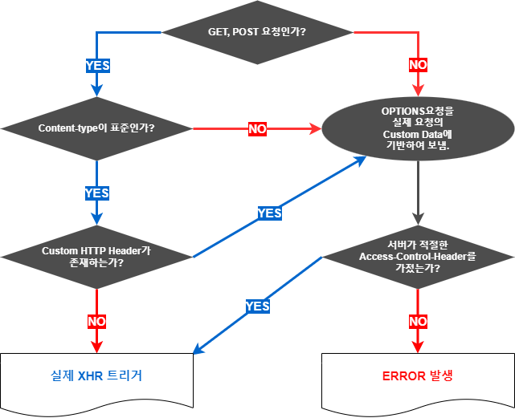

# WIL #5
## 항해99 부트캠프 ing

### CORS 를 해결하는 3가지 방법 (Filter, @CrossOrigin, WebMvcConfigurer)


* CORS 해결하기

  **CORS 는 에러나 오류가 아니라, Cross-Origin Resource Sharing Policy이란 하나의 보안 정책이다.**

  이러한 보안 정책이 발생하는 이유를 간단히 이야기 하자면, SOP 때문이다.

* SOP 란?

    SOP 는 Same Origin Policy 로, 동일한 출처의 Origin 만 리소스(데이터)를 공유할 수 있는 것이다.

    만약 동일한 출처가 아니라면 OPTIONS 를 이용한 Preflight 를 이용해서 여러 검증을 거치게 되는데, 이 검증이 바로 Cors 인 것이다.

* CORS 의 간단 플로우는?

  Front Back 구조에서 SOP 를 위반하고, 적절한 보안 인증을 받기 위해서 브라우저는 다음과 같은 과정을 거치게 된다.
  
  

  * GET 요청인지 POST 요청인지 파악한다.
  * Content-Type 과 Custom HTTP Header 를 파악한다.
  * OPTIONS 요청을 통해서 서버가 적절한 Access-Control-* 를 가졌는지 확인한다.
  * 만약 적절한 Access-Control 을 가졌다면 실제 XHR을 트리거한다.
  * 적절하지 못한 Access-Control 를 가졌다면 Error 를 발생시킨다.

  이 플로우에서 적절한 대처를 하지 못한다면 발생하는 것이 맨 위에서 본 CORS 에러인 것이다.


* Spring Boot Application 에서 CORS 해결하기

  **Preflight 요청에서 적절한 Access-Control 을 확인하지 못하면 발생하게 된다!**
 
  이런 Preflight 상황에서 적절한 Access-Control 을 위한 해결 방법이 3가지가 존재한다.

  * CorsFilter 로 직접 response에 header 를 넣어주기
  * Controller 에서 @CrossOrigin 어노테이션 추가하기
  * WebMvcConfigurer 를 이용해서 처리하기

* CorsFilter 생성하기

  첫 번째로 알아볼 방법은 커스텀 필터를 만드는 것이다.

  Access-Control 을 확인할 수 있도록 커스텀 Filter 를 생성해보자.

  filter 라는 디렉토리를 생성하고, 해당 디렉토리 아래에 CorsFilter 라는 클래스를 하나 생성한다.

  @Component 이라는 어노테이션을 추가하고, Filter 인터페이스를 구현하여 Override 한다.

  **주의해야할 것이 있는데, Filter 는 꼭 javax.servlet 의 Filter를 사용해야 한다.**

  ```JAVA
  @Component
  @Order(Ordered.HIGHEST_PRECEDENCE)
  public class CorsFilter implements Filter {
      @Override
      public void init(FilterConfig filterConfig) throws ServletException {

      }

      @Override
      public void doFilter(ServletRequest req, ServletResponse res, FilterChain chain) throws IOException, ServletException {

      }

      @Override
      public void destroy() {

      }
  }
  ```

  해당 필터가 실제로 수행할 doFilter 를 커스텀해야 한다.

  ```JAVA
  @Component
  @Order(Ordered.HIGHEST_PRECEDENCE)
  public class CorsFilter implements Filter {

      @Override
      public void init(FilterConfig filterConfig) throws ServletException {

      }

      @Override
      public void doFilter(ServletRequest req, ServletResponse res, FilterChain chain) throws IOException, ServletException {
          HttpServletRequest request = (HttpServletRequest) req;
          HttpServletResponse response = (HttpServletResponse) res;

          response.setHeader("Access-Control-Allow-Origin", "http://localhost:3000");
          response.setHeader("Access-Control-Allow-Credentials", "true");
          response.setHeader("Access-Control-Allow-Methods","*");
          response.setHeader("Access-Control-Max-Age", "3600");
          response.setHeader("Access-Control-Allow-Headers",
                  "Origin, X-Requested-With, Content-Type, Accept, Authorization");

          if("OPTIONS".equalsIgnoreCase(request.getMethod())) {
              response.setStatus(HttpServletResponse.SC_OK);
          }else {
              chain.doFilter(req, res);
          }
      }

      @Override
      public void destroy() {

      }
  }
  ```

  필요한 헤더를 OPTIONS 가 잘 확인할 수 있도록 설정해줄 수 있다.


* CrossOrigin 어노테이션 사용하기

  CrossOrigin 어노테이션을 사용하는 방법은 매우 간단하다.

  컨트롤러에서 특정 메서드 혹은 컨트롤러 상단부에 @CrossOrigin 만 추가하면 된다.

  ```JAVA
  @RestController
  @RequestMapping(value = "/api/threats", produces = "application/json")
  @CrossOrigin(origins = "http://front-server.com") // 컨트롤러에서 설정
  public class ThreatController {

      private final ThreatService threatService;

      public ThreatController(ThreatService threatService) {
          this.threatService = threatService;
      }

      @GetMapping
      @CrossOrigin(origins = "http://front-server.com") // 메서드에서 설정
      public ResponseEntity<ThreatLogCountResponse> getAllThreatLogs() {
          return ResponseEntity.ok(threatService.getAllThreatLogCount());
      }
  }
  ```
  설정 방법은 2가지가 있는데,

  * 컨트롤러 클래스 단에서 설정
  * 메서드 단에서 설정

  둘중 하나의 방법만 사용해도 된다.

  하지만 단점이라고 한다면 컨트롤러가 많을 수록 설정해야하는 어노테이션이 많아진다는 것이다.

* WebMvcConfigurer 에서 설정하기

  해당 사용법도 간단하다.

  Spring Initializer 를 이용해서 프로젝트를 만들었다면 다음과 같은 main 함수가 존재한다.

  ```JAVA
  @SpringBootApplication
  public class RestServiceCorsApplication {

      public static void main(String[] args) {
          SpringApplication.run(RestServiceCorsApplication.class, args);
      }
  }
  ```

  해당 main 함수에서 Bean 으로 Configurer 를 추가해주면 된다.

  ```JAVA
  @SpringBootApplication
  public class RestServiceCorsApplication {

      public static void main(String[] args) {
          SpringApplication.run(RestServiceCorsApplication.class, args);
      }

      @Bean
      public WebMvcConfigurer corsConfigurer() {
          return new WebMvcConfigurer() {
              @Override
              public void addCorsMappings(CorsRegistry registry) {
                  registry.addMapping("/**").allowedOrigins("http://front-server.com");
              }
          };
      }

  }
  ```

출처 : [https://wonit.tistory.com/572](https://wonit.tistory.com/572)